<div align="center">

  <h1>Edge Vehicle Detection &amp; Tracking</h1>
  <p><strong>Python · PyTorch · Ultralytics YOLO · OpenCV · SAHI · ByteTrack · Supervision · ONNX Runtime</strong></p>
  <p>
    <a href="#pipeline">Explore the pipeline</a>
    · <a href="#results">See detection results</a>
    · <a href="#tracking-demos">Watch tracking demos</a>
    · <a href="#getting-started">Getting started</a>
    · <a href="#code-guide">Code guide</a>
  </p>

</div>

A computer vision pipeline combining VisDrone data preparation, YOLO training, SAHI sliced inference, and ByteTrack to detect and track small objects in crowded traffic scenes, with model optimization for edge inference.

## Object detection examples

Three VisDrone scenes showing baseline and trained-model predictions under different traffic, lighting, and occlusion conditions.

| Baseline detection | Trained detection |
| --- | --- |
| **Daytime traffic**<br>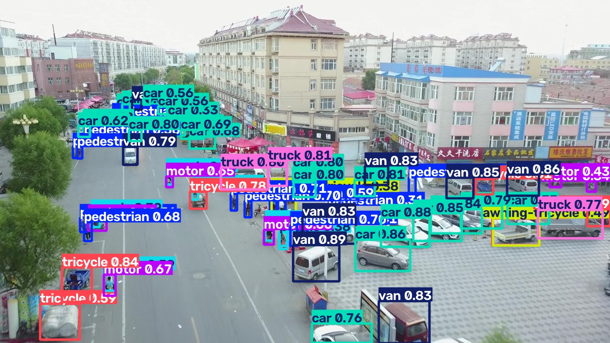 | **Daytime traffic**<br>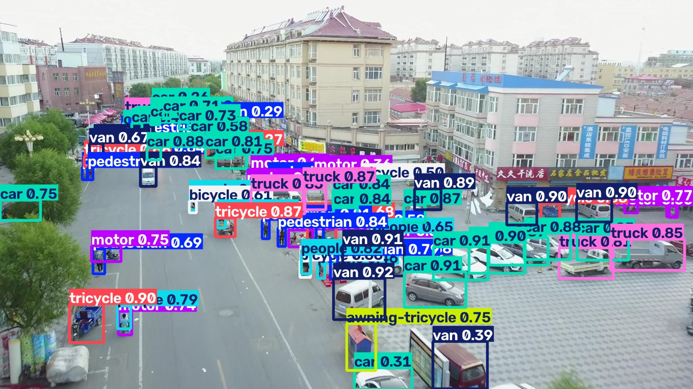 |
| **Nighttime road**<br>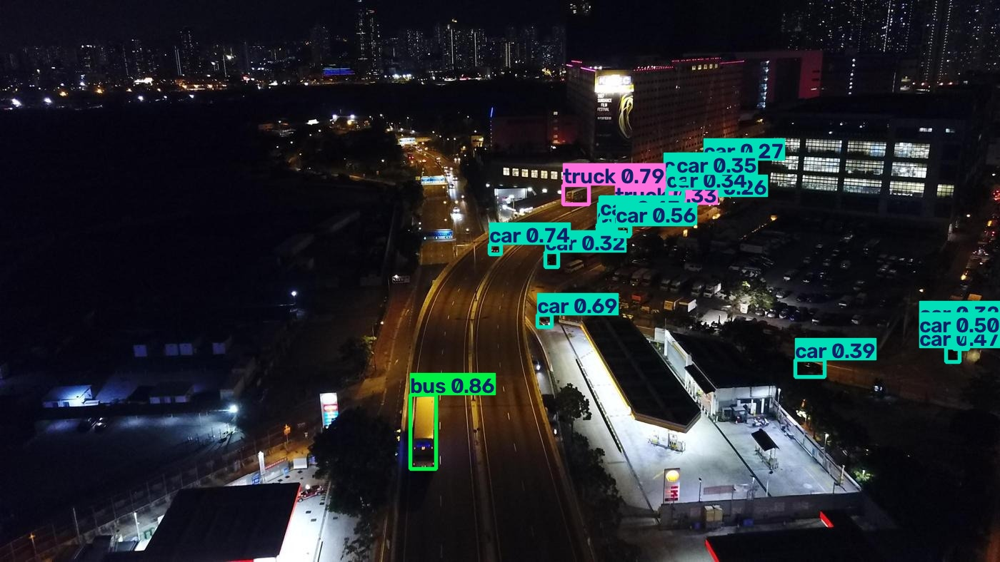 | **Nighttime road**<br>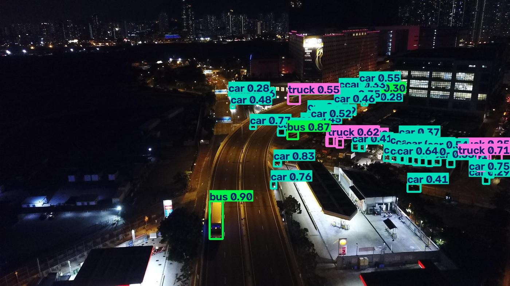 |
| **Residential parking**<br>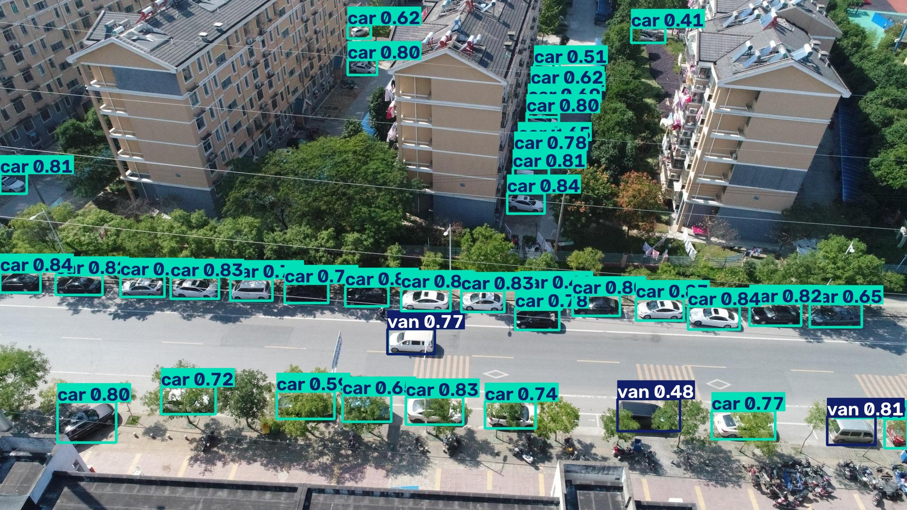 | **Residential parking**<br>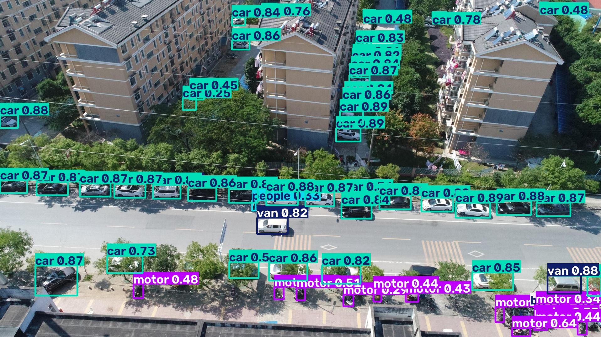 |

*Each row compares saved predictions on the same image. Click any image for full resolution. Quantitative results and evaluation scope are documented below.*

## Tracking demos

Two examples of SAHI sliced detection and ByteTrack maintaining object identities and trajectories:

| Aerial basketball scene | Walking pedestrians |
| --- | --- |
| [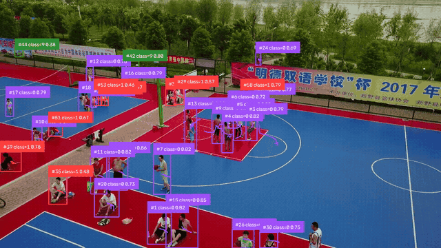](docs/previews/tracking_basketball.mp4) | [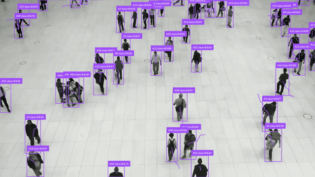](docs/previews/tracking_people_walk.mp4) |
| **[Watch full video](docs/previews/tracking_basketball.mp4)** · 464 frames | **[Watch full video](docs/previews/tracking_people_walk.mp4)** · 341 frames |
| [MOT predictions](docs/tracking/tracking_basketball.txt) | [MOT predictions](docs/tracking/tracking_people_walk.txt) |

*Each preview shows a five-second excerpt. Click a preview or “Watch full video” to open the complete MP4. Playback timing is preserved; it does not represent processing throughput.*

An additional [synthetically blurred basketball video](docs/previews/tracking_basketball_blur.mp4) and its [predictions](docs/tracking/tracking_basketball_blur.txt) support inspection of degraded-video behavior. These clips demonstrate pedestrian tracking; vehicle line-crossing analytics are implemented separately in [line_crossing.ipynb](line_crossing.ipynb). [Preview provenance](docs/previews/README.md).

## Results

The repository includes training logs, precision-format experiments, and a tracking evaluation. **These are separate experiments:** their accuracy and timing values should not be combined into a single model benchmark. Detection and identity scores below are percentages.

### Detection: baseline vs. trained model

**Baseline:** [dronefreak/visdrone-yolov26x](https://huggingface.co/dronefreak/visdrone-yolov26x), an open-source YOLOv26x model fine-tuned on VisDrone.

Both evaluations cover **548 images and 38,759 ground-truth objects**. The trained model reaches **57.02% mAP@50 and 36.10% mAP@50–95**. [Detection results](docs/obb.csv).

| Model    | Precision | Recall | mAP@50 | mAP@50–95 | Reported inference |
| -------- | --------: | -----: | -----: | --------: | -----------------: |
| Baseline |    52.91% | 41.06% | 38.33% |    22.48% |            **51.6 ms** |
| **Trained** | **69.34%** | **74.67%** | **57.02%** | **36.10%** | 53.6 ms |

The **Trained** row corresponds to `my_trained` in the CSV. The [training notebook](train_model.ipynb) initializes **YOLO11n** from `yolo11n.pt`, but the CSV does not identify the evaluated architecture, checkpoint, or full evaluation settings. The [quickstart](#3-train-and-validate) demonstrates a new YOLO11n run; reproducing the reported scores requires those missing experiment details. These timings are separate from the precision-format experiment below.

<details>
<summary>Training-log results</summary>

The strongest entry in the [saved detection-training log](docs/train_log.csv) reports **71.26% mAP@50 and 48.09% mAP@50–95**. These training-log measurements are distinct from the comparison above.

| Saved log entry | Precision | Recall | mAP@50 | mAP@50–95 |
| --- | ---: | ---: | ---: | ---: |
| Best mAP, entry 6 | 69.03% | 65.44% | **71.26%** | **48.09%** |
| Last entry, 15 | 68.46% | 58.75% | 61.29% | 39.05% |

The file combines log segments with elapsed-time resets and differing learning-rate columns. Entry numbers identify saved rows; they do not establish one continuous 15-epoch run. Checkpoint and evaluation-split identifiers are not recorded in this CSV.

</details>

### Inference optimization

The **NVIDIA T4** measurements compare four versions of the trained detector. **FP16 is 2.42× faster than FP32**, with a **0.031 percentage-point** decrease in mAP@50. **Static INT8 is 3.14× faster**, trading **2.927 percentage points** of mAP@50 for the lowest recorded latency. Values below use the `my_trained` rows in [quantization.csv](docs/quantization.csv).

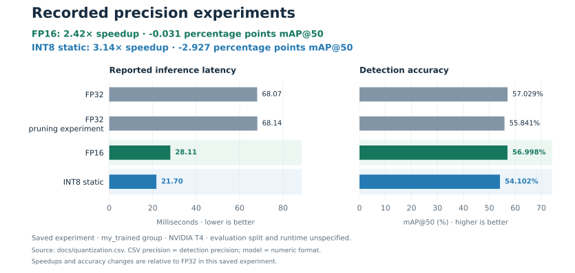

| Format / experiment | Precision | Recall | mAP@50 | mAP@50–95 | Reported inference |
| --- | ---: | ---: | ---: | ---: | ---: |
| FP32 | 69.348% | 74.578% | 57.029% | 36.102% | 68.07 ms |
| FP32 pruning trial | 68.512% | 73.512% | 55.841% | 34.710% | 68.14 ms |
| **FP16** | **69.301%** | **74.544%** | **56.998%** | **36.071%** | **28.11 ms** |
| **Static INT8** | 66.423% | 71.186% | 54.102% | 32.698% | **21.70 ms** |

The pruning trial reduces accuracy without improving latency in this run.

These are reported inference timings on an NVIDIA T4. The execution provider, evaluation split, sample count, and timing scope are not recorded; end-to-end tracking and target edge-device throughput remain separate measurements. The [plot script](docs/plots/plot_quantization.py) regenerates the chart from the CSV.

### Tracking evaluation

The [saved tracking report](docs/tracking_metrics.csv) evaluates a **VisDrone validation video sequence**:

| Frames | MOTA | IDF1 | ID precision | ID recall | ID switches |
| ---: | ---: | ---: | ---: | ---: | ---: |
| 464 | 46.09% | **62.52%** | 61.69% | 63.38% | 241 |

The report also records **6,643 false positives and 5,988 misses**. It identifies the run as `Tracker`; the exact sequence ID, ground-truth configuration, and evaluator settings are not included. Results apply to this validation sequence rather than the complete VisDrone benchmark.


## Engineering highlights

| Challenge | Implementation | Evidence |
| --- | --- | --- |
| Small objects in high-resolution scenes | **640 × 640 tiles**, 20% overlap during dataset tiling, and 10% overlap during SAHI inference. Video inference merges overlapping detections with `GREEDYNMM` and an intersection-over-smaller-area threshold of 0.5. | [Training / slicing](train_model.ipynb), [video pipeline](video_inference.ipynb) |
| Reliable temporal output | A fresh **ByteTrack** instance per video, updates on empty frames, 30-point trajectories, and synchronized MP4 / MOT exports with frame-based indexing. Two directional line counters extend tracks into traffic analytics. | [Tracking](video_inference.ipynb), [line counting](line_crossing.ipynb) |
| Annotation integrity | Normalize different archive layouts; validate image–label pairing; stage archives before replacing splits; preserve empty labels. Six seeded augmentation policies transform boxes alongside images and leave validation unaugmented. | [Data preparation](src/data.py), [augmentation](src/augmentation.py) |
| Correct detection evaluation | Custom **class-aware recall** with confidence-ordered, one-to-one IoU matching and explicit true-positive / false-negative counts. Tests cover archive conversion, matching, and input consistency. | [Evaluator](src/recall.py), [tests](tests/) |
| Deployment tradeoffs | ONNX preprocessing, output decoding, NMS, and coordinate restoration; FP16 conversion, calibration-driven static 8-bit quantization, and graph-optimization experiments. | [Notebook](quantization.ipynb), [measurements](docs/quantization.csv) |

Custom work centers on data preparation, augmentation/export logic, evaluation, and pipeline integration. Detector architectures, tracking algorithms, and sliced-inference primitives use the libraries credited below.

## Pipeline

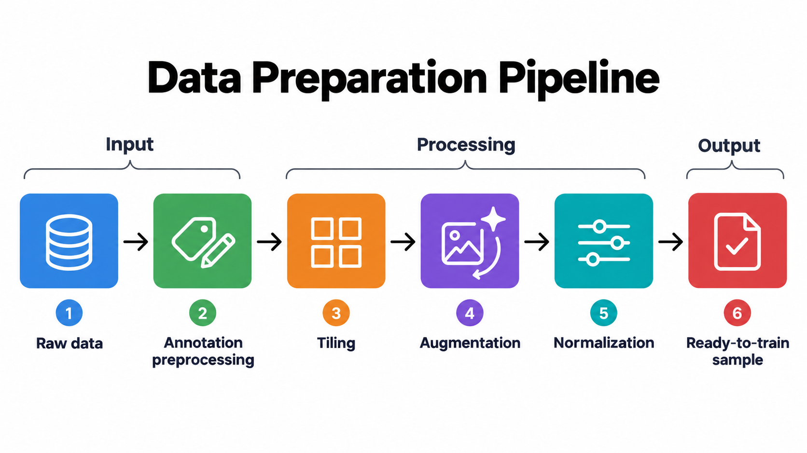

The overview illustrates a workflow with tiling followed by training-time augmentation. In [train_model.ipynb](train_model.ipynb), tiling creates `data_small_tiled/`, but both training calls currently use the untiled `data_small/data.yaml`. To train on tiles, point the intended training call to `data_small_tiled/data.yaml` after generating that dataset.

The optional [offline augmentation workflow](data_augmentation.ipynb) exports full-image variants before tiling. Validation images remain unaugmented. Dataset inspection measures class balance, box sizes, and image quality to guide these choices.

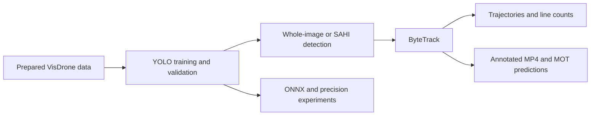

<details>
<summary>View all six augmentation policies with transformed annotations</summary>

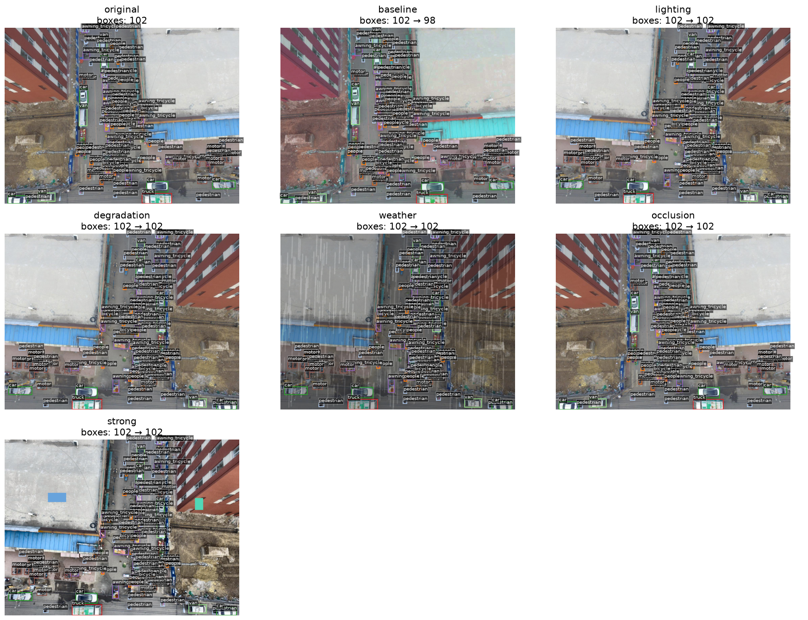

Saved preview from [data_augmentation.ipynb](data_augmentation.ipynb). Policies cover baseline transformations, lighting, degradation, weather, occlusion, and stronger combinations. Box counts make annotation changes visible.

</details>

## Datasets

| Dataset | Role in this project |
| --- | --- |
| [VisDrone2019-DET](https://github.com/VisDrone/VisDrone-Dataset) | Detection training, validation, dataset analysis, augmentation, and tiling experiments. The local image inventory contains 6,471 train, 548 validation, and 1,610 test-dev images. |
| [VisDrone2019-VID](https://github.com/VisDrone/VisDrone-Dataset) | Aerial tracking experiments, including sequence `uav0000086_00000_v` and a synthetically blurred variant. |
| [MOT17](https://motchallenge.net/data/MOT17/) / [MOT20](https://motchallenge.net/data/MOT20/) | Tracking experiments on `MOT17-01-DPM` and `MOT20-04`, extending inspection to crowded pedestrian scenes. |

The detection configuration retains VisDrone's original category IDs and its broader traffic classes, including pedestrians and bicycles. Raw-annotation conversion excludes category `0` (ignored regions); the generated class-name mapping still includes all 12 original entries. These choices matter when comparing predictions against labels or external benchmark results.

## Technology stack

See [requirements.txt](requirements.txt) for the core dependencies. Supporting tools include **yolo-tiling**, **AlbumentationsX** (`albumentations` API), **CleanVision**, and **NumPy / pandas / PyYAML / Matplotlib**. Experiments use **Jupyter / Google Colab**, with **unittest** regression checks. Additional ONNX packages are listed in the [optimization setup](#5-run-optimization-experiments-optional).

## Getting started

### 1. Set up the environment

```bash
git clone https://github.com/DavidIlnytskyi/Edge-Vehicle-Detection-and-Tracking.git
cd Edge-Vehicle-Detection-and-Tracking

conda create -n image-object-detection python=3.13
conda activate image-object-detection
python -m pip install -r requirements.txt
```

Open notebooks in a Jupyter-capable editor with this environment selected. For a standalone notebook interface, install `jupyterlab`. Set dataset and checkpoint paths for your environment before running experiment notebooks.

Dependencies are currently unpinned. Choose a PyTorch build appropriate to your CPU/CUDA environment before starting training.

### 2. Prepare VisDrone

Download the detection archives from the [official dataset repository](https://github.com/VisDrone/VisDrone-Dataset) and place them in `zips/`. Run from the repository root:

```python
from src.data import extract_visdrone_archives

dataset_dir = extract_visdrone_archives([
    "zips/VisDrone2019-DET-train.zip",
    "zips/VisDrone2019-DET-val.zip",
    "zips/VisDrone2019-DET-test-dev.zip",
])
print(dataset_dir / "data.yaml")
```

This produces `data/images/{train,val,test}`, matching `data/labels/` directories, and `data/data.yaml`. Re-extraction replaces the supplied splits after staging succeeds. Dataset archives and trained experiment checkpoints must be supplied separately.

### 3. Train and validate

Use the reusable helper for a basic training run; [train_model.ipynb](train_model.ipynb) contains the more detailed experiment settings.

```python
from src.training import train_model, validate_model

train_model(
    data_config="data/data.yaml",
    weights="yolo11n.pt",
    epochs=50,
    image_size=640,
    batch=6,
    project="runs/train",
    name="visdrone",
)

# Use the best.pt path produced by your run.
metrics = validate_model(
    data_config="data/data.yaml",
    weights="runs/train/visdrone/weights/best.pt",
    image_size=640,
)
```

### 4. Run video inference

Open [video_inference.ipynb](video_inference.ipynb) and set `MODEL_PATH`, `input_videos`, `OUTPUT_DIR`, and `DEVICE` in the final batch configuration; it overrides the earlier example settings. Use your trained checkpoint and choose `cpu` or the appropriate CUDA device. Skip the optional image-sequence conversion when using existing MP4s. The workflow saves annotated MP4 and MOT-format predictions together.

### 5. Run optimization experiments (optional)

Install the additional packages used by [quantization.ipynb](quantization.ipynb):

```bash
python -m pip install onnx onnxconverter-common onnxoptimizer
```

The notebook defaults to **Google Colab** and uses Drive paths. For local execution, set `via_colab = False`, remove or guard the `google.colab` imports, skip Colab setup cells, and replace `cv2_imshow` with a local display method. Update archive, dataset, checkpoint, ONNX, and example-image paths; use the prepared validation images at `data/images/val`.

**Before running the notebook, disable the cell beginning `!find ./data/images/val`.** It uses `shuf -n 400` and `rm` to randomly delete up to 400 validation images while leaving their labels. Run the selected experiment cells after reviewing their inputs and outputs.

## Code guide

| Entry point | Purpose |
| --- | --- |
| [load_data.ipynb](load_data.ipynb) · [src/data.py](src/data.py) · [src/dataset.py](src/dataset.py) | Archive preparation, YOLO layout, dataset loading |
| [visualize_data.ipynb](visualize_data.ipynb) · [src/analysis.py](src/analysis.py) | Dataset composition, bounding-box statistics, quality inspection |
| [data_augmentation.ipynb](data_augmentation.ipynb) · [src/augmentation.py](src/augmentation.py) | Augmentation previews and dataset export |
| [train_model.ipynb](train_model.ipynb) · [src/training.py](src/training.py) | Tiling, YOLO training, validation, SAHI experiments |
| [src/recall.py](src/recall.py) · [recall_analysis.ipynb](recall_analysis.ipynb) | Recall evaluation and exploratory error analysis |
| [video_inference.ipynb](video_inference.ipynb) · [line_crossing.ipynb](line_crossing.ipynb) | Multi-object tracking, annotated videos, traffic counts |
| [quantization.ipynb](quantization.ipynb) | ONNX inference and precision/optimization experiments |
| [tests/](tests/) | Regression checks for data preparation and evaluation |

## Acknowledgments

Built with [Ultralytics](https://github.com/ultralytics/ultralytics), [ByteTrack](https://github.com/ifzhang/ByteTrack), [Supervision](https://github.com/roboflow/supervision), [SAHI](https://github.com/obss/sahi), and [ONNX Runtime](https://onnxruntime.ai/). Dataset credit goes to the [VisDrone](https://github.com/VisDrone/VisDrone-Dataset) and [MOTChallenge](https://motchallenge.net/) teams.
